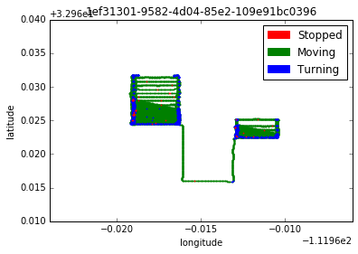
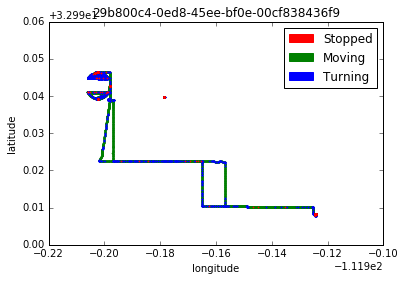

# GPS-faming-equipment
Extrapolating information from GPS/GIS farm equipment data. 

## Overview
The goal of this project was to take GPS location data from several fram equipment devices and determine:

1. Provide how many turns each equipment made.

2. Provide stationary times for all devices. “Stationary times” are time ranges for when a equipment was sending location data to the server but was not moving.

3. Provide any other valuable information you can extract from the data set.

Summaries of how you came to your solutions are required.  You can deliver your solutions to me via a link to a GitHub repo or as an email attachment. Both should include instructions on how I can I run any scripts (if provided).

## Features
- Starting Features: device_id,	time_in_seconds	id,	latitude,	longitude	heading
- Engineered Features: 	heading_change,	distance_in_degrees,	duration_in_seconds,	MPH

## Maps Analysis

- Average MPH:  7.4
- Max MPH:  23.7
- Time Stopped: 24.62 mins 
- Time Moving: 188.57 mins 
- Time Turning: 34.73 mins 

- Average MPH:  7.5
- Max MPH:  38.3
- Time Stopped: 84.12 mins 
- Time Moving: 297.73 mins 
- Time Turning: 33.37 mins

- Average MPH:  6.7
- Max MPH:  21.4
- Time Stopped: 30.18 mins 
- Time Moving: 441.95 mins 
- Time Turning: 36.53 mins 

- Average MPH:  3.5
- Max MPH:  30.9
- Time Stopped: 448.65 mins 
- Time Moving: 382.37 mins 
- Time Turning: 61.52 mins 

- Average MPH:  8.0
- Max MPH:  38.7
- Time Stopped: 120.5 mins 
- Time Moving: 370.12 mins 
- Time Turning: 57.82 mins 

- Average MPH:  8.3
- Max MPH:  55.2
- Time Stopped: 30.83 mins 
- Time Moving: 23.67 mins 
- Time Turning: 5.5 mins 

- Average MPH:  7.3
- Max MPH:  48.4
- Time Stopped: 340.5 mins 
- Time Moving: 244.38 mins 
- Time Turning: 24.98 mins 

- Average MPH:  5.1
- Max MPH:  88.0
- Time Stopped: 100.8 mins 
- Time Moving: 389.52 mins 
- Time Turning: 40.05 mins 

- Average MPH:  0.3
- Max MPH:  15.2
- Time Stopped: 3.92 mins 
- Time Moving: 0.05 mins 
- Time Turning: 0.02 mins

- Average MPH:  7.2
- Max MPH:  67.5
- Time Stopped: 85.5 mins 
- Time Moving: 375.5 mins 
- Time Turning: 45.27 mins 
